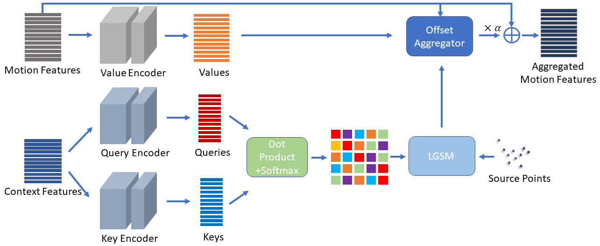

# GMA3D: Local-Global Attention Learning to Estimate Occluded Motions of Scene Flow

## News
GMA3D was accepted in PRCV2023!

## Movie
<video src="./Test_3_1.mp4"></video>

## Environments

You will have to choose cudatoolkit version to match your compute environment. 

```python
conda create --name GMA3D python==3.8
conda activate GMA3D
conda install pytorch=1.12.0 torchvision=0.13.0 cudatoolkit=11.3.1 -c pytorch -c conda-forge
conda install tqdm tensorboard scipy imageio
pip install pypng
pip install torch-scatter -f https://pytorch-geometric.com/whl/torch-1.12.0+cu113.html
```

## Abstract


## Architecture



## Datasets

To verify the performance of GMA3d  both the occluded version datasets and the non-occluded version datasets.  According to [FLOT](https://github.com/valeoai/FLOT) ,  We call the occluded datasets FlyThings3Do and KITTIo, and the non-occluded dataset FlyThings3Ds and KITTIs.


## Utilization

#### Train

training and refine on the FlyThings3D dataset without occlution 

```python
python train.py --exp_path=gma3d-noocc --dataset=FT3D --batch_size=1 --gpus=7 --num_epochs=45 --max_points=8192 --iters=12  --root=./
python train.py --refine --exp_path=refine_gma_res_nor_e45_it12_2 --dataset=FT3D --batch_size=1 --gpus=4 --num_epochs=10 --max_points=8192 --iters=32 --root=./ --weights=./experiments/gma3d_res_nor_e50_it12_2/checkpoints/best_checkpoint.params

```

training and refine on the FlyThings3D dataset with occlution

```python
python train.py --exp_path=gma3d-occ --dataset=FT3DO --batch_size=1 --gpus=7 --num_epochs=45 --max_points=8192 --iters=12  --root=./
python train.py --refine --exp_path=refine_gma_res_nor_e50_it12_2 --dataset=FT3DO --batch_size=1 --gpus=4 --num_epochs=10 --max_points=8192 --iters=32 --root=./ --weights=./experiments/gmaed_res_nor_e50_it12_2/checkpoints/best_checkpoint.params
```

#### Test

testify on the KITTI dataset without occlution

```python
python test.py --refine --dataset=KITTI --exp_path=KITTI --gpus=5 --max_points=8192 --iters=32 --root=./ --weights=./experiments/refine_gmaed_res_nor_e50_it12_2/checkpoints/best_checkpoint.params 
```

testify on the KITTI dataset with occlution

```
python test.py --refine --dataset=KITTIO --exp_path=KITTI --gpus=5 --max_points=8192 --iters=32 --root=./ --weights=./experiments/refine_gmaed_res_nor_e50_it12_2/checkpoints/best_checkpoint.params 
```


## Acknowledgement

The backbone arcitecture of our GMA3D module [PV-RAFT](https://github.com/weiyithu/PV-RAFT). We also refer to [PCT](https://github.com/MenghaoGuo/PCT). 
